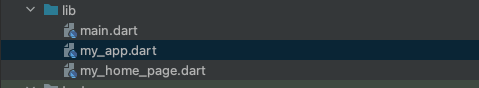

# Flutter BDD

En este artículo vamos a crear una aplicación para móviles por defecto en flutter pero siguiendo la estrategia de diseño guiado por el comportamiento BDD https://cucumber.io/docs/bdd/

## Prerrequisitos

- Instalar flutter https://docs.flutter.dev/get-started/install
- Vamos a utilizar Android Studio https://developer.android.com/studio como entorno de desarrollo integrado. 

## Primeros pasos

- Creamos una nueva app 
- Seleccionamos un emulador android y ejecutamos la app 
- Ahora vamos a separar los tres componentes principales de la app en archivos separados .

## Getting Started

This project is a starting point for a Flutter application.

A few resources to get you started if this is your first Flutter project:

- [Lab: Write your first Flutter app](https://docs.flutter.dev/get-started/codelab)
- [Cookbook: Useful Flutter samples](https://docs.flutter.dev/cookbook)

For help getting started with Flutter development, view the
[online documentation](https://docs.flutter.dev/), which offers tutorials,
samples, guidance on mobile development, and a full API reference.

flutter pub add mockito
